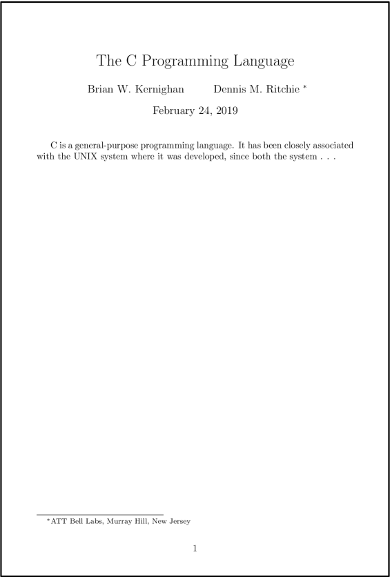
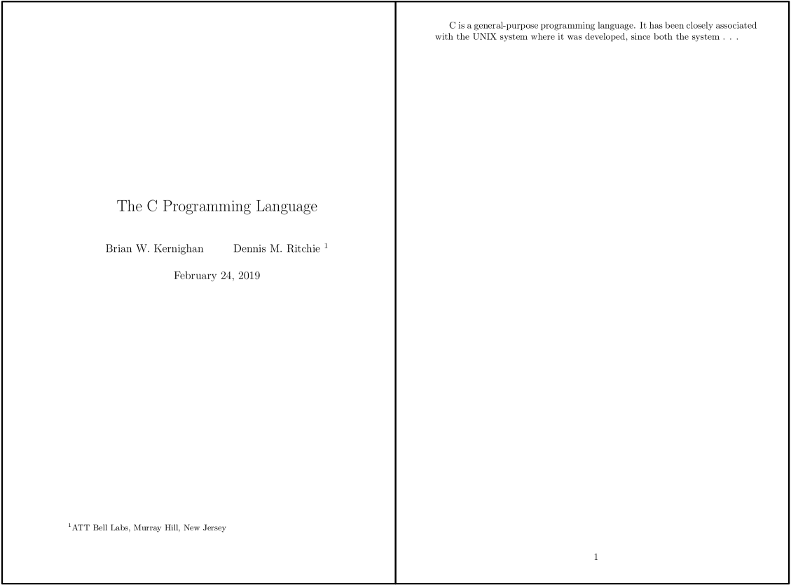

> In this episode we will learn the essential structure of a document produced in LaTeX, and we will
> begin to create our first document.
{: .callout}

## Document Organization

When creating a document in a [WYSIWYG]({{ page.root }}/reference/#WYSIWYG) editor, we tend to
think of the document as a whole.  We think as writers.  Each portion of the document is a jumble
that must be perfected as it is written.

When a document is created in [LaTeX]({{ page.root }}/reference/#LaTeX), we must write commands like
programmers.  Each portion of the document may be constructed independent of content or context.
Commands are given which will perform the same function upon each compile.  Just as we run commands
like programmers, we must learn to think like *programs*.  Each portion of the LaTeX
[markdown language]({{ page.root }}/reference/#markdown language) must follow orders (or commands) that can be
interpreted by the compiler and have logical flow.

For this reason, we organize our document into parts which compromise between making sense to the compiler
and making sense to the operator.  In the most general sense, we divide a [.tex]({{ page.root }}/reference/#.tex)
document into [preamble]({{ page.root }}/reference/#preamble), and content sections.  The preamble
is where we tell the compiler everything it needs to know to be able to process the content within while the content section contains the actual text, information, figures, etc. that the final document will contain.

We distinguish these sections by restricting them to an
[environment]({{ page.root }}/reference/#environment).  For example, the content of a document will
be entirely contained within an environement we call `document`.  An environment must have a
beginning and an end, making it look like:

~~~
\begin{document}
  our document's contents
\end{document}
~~~
{: .language-tex}

The minimum acceptable document in LaTeX must include declaring the `documentclass`, then using a
`document` environment.

~~~
\documentclass{minimal}

\begin{document}
  The simplest document
\end{document}
~~~
{: .language-tex}

The `documentclass` tells the LaTeX interpreter program what style to apply to our output. There
are many different document classes aside from `minimal` which we will discuss later, but for now,
we will confine all of our experiments and learning in this format.

The code is organized such that all of the declarations about *how* LaTeX should form the document,
including `documentclass` are placed in the preamble.  Everything else must be bound by the
`document` environment.

## Commands and Environments

The entirety of "our document's contents" is bound by commands.  We can tell that these are
commands in LaTeX, commands are declared with the backslash (`\`).  An environment will `begin` and
`end` at the boundaries declared.  So if we want to use a
[math mode]({{ page.root }}/reference/#math mode) environment (something which will be discussed
later in this lesson) with an equation we would use:

~~~
\begin{document}
  \begin{equation}
    our equation
  \end{equation}
\end{document}
~~~
{: .language-tex}

Some commands in LaTeX are not treated as environments.  These direct commands are also called
using the backslash (`\`), but they do not have be told where to begin and end.  A command executes
only once each time it is called.  Within the math mode environment above, we will execute a
command to insert the special character for the lowercase Greek letter, sigma (σ).

~~~
\begin{document}
  \begin{equation}
    \sigma
  \end{equation}
\end{document}
~~~
{: .language-tex}
~~~
σ
~~~
{: .output}

Commands can have one or more [argument]({{ page.root }}/reference/#argument) when it is called.
An argument modifies the command in some manner.  In LaTeX, optional arguments are declared using
braces (`[` and `]`).  Main arguments are declared within curly braces (`{` and `}`).

> When you experience and eror when compiling your document, always check your curly braces
{: .callout}

If a command is called without using these characters, LaTeX will assume you included a set of
empty curly braces.  Thus,

~~~
\someCommand
~~~
{: .language-tex}

defaults to

~~~
\someCommand{}
~~~
{: .language-tex}

Since the command `\sigma` used above does not *require* an argument, it is accepted by the
compiler.  Some commands require one or more argument to function.  In this case, the compilation
would fail and give an error.  It is important to know what each command requires when you use it.

## Special Characters

LaTeX reads each character written in the code and interprets it based on the context.  Certain
characters such as the back slash `\`, as we have seen, have special properties.  But what if we
wish to use a character in our document that has been assigned as a special character?  In this
case, we must tell LaTeX to treat the character like text instead of as a command.  For this purpose, LaTeX provides
[escape sequences]({{ page.root }}/reference/#escape sequence) which print the character.  These
escape sequences operate similar to commands by telling the program do a specific action and not being present in the final document.  So if we wish to include a back slash in our text,
we use the command `\textbackslash`:

~~~
\textbackslash
~~~
{: .language-tex}
~~~
\
~~~
{: .output}

Most special characters are escaped with a backslash and the symbol, but others require a command
phrase.  The correct command phrase may be esoteric to a novice LaTeX user, and difficult to
remember.  There are many sources available on the internet which can assist with finding the
'magic word'.  The following characters are common examples that have special meaning within LaTeX, and require escape
sequences:

~~~
\& \% \$ \# \_ \{ \} \textasciitilde \textasciicircum \textbackslash
~~~
{: .language-tex}

~~~
& % $ # _ { } ~ ^ \
~~~
{: .output}

Each of these symbols, un-escaped, affect the compilation of the LaTeX code.  For example, use of
the percent sign (`%`) tells LaTeX to treat the rest of the line as a
[comment]({{ page.root }}/reference/#comment).  Comments allow the user to hide text such as notes
to other authors or unused code from the compiler, such that it does not appear on the final
document.

~~~
Print this text but not
%this text
comments
~~~
{: .language-tex}

~~~
Print this text but not
comments
~~~
{: .output}

## Titles

Title and author information are stored as variables using the `\title` and `\author` commands,
respectively.  In most default LaTeX document styles, individual authors are separated with `\and`.
The LaTeX backend will handle separating them with commas or other formatting sequences
automatically.  To add author information such as affiliation or addresses, the `\thanks` sequence
can be called.  Information within the curly braces will be printed in a manner consistent with the
style.

~~~
\documentclass{article}

\author{Brian W. Kernighan
\and Dennis M. Ritchie \thanks{AT&T Bell Labs, Murray Hill, New Jersey}}
\title{The C Programming Language}

\begin{document}
  \maketitle

  C is a general-purpose programming language. It has been closely associated with the UNIX
  system where it was developed, since both the system . . .
\end{document}
~~~
{: .language-tex}

## Classes and Styles

The style of a document is declared in the preamble section using the `\documentclass` command.  It
is important that it is declared **first** in the preamble, as other commands rely on its input.

There are many styles available for LaTeX documents.  The minimum LaTeX build provides the
`article`, `book`, `report`, and `letter` styles.  There are several styles which have been
provided by users that are present in a default build such as `memoir` and `beamer`, as they are
used so often by all types of users, the maintainers felt they were worth including.

You can think of a style as a document template (although they are much more complex than that).  All of
the information about where and how your text should go in the document is stored there.  The
advantage of this type of program is how easy it makes to switch from one style to another.  We
can switch the simple title example from the section above from the `article` format to the
`report` format and see a noticeable difference in how the output looks.

~~~
\documentclass{report}
~~~
{: .language-tex}

Styles usually have options available to them.  The options can be declared by typing them between
square braces (`[` and `]`) before the curly braces.  Each option is separated by a comma.  The
options declared in `documentclass` are [globals]({{ page.root }}/reference/#global), meaning they
apply to the entire document.  Unless the user specifically tells the compiler to change the
settings, this will be the default for the entire document.

#### Options Available to Default Styles

| Command                  | Level                  |
|:-------------------------|:-----------------------|
| font size                | 10pt, 11pt, 12pt       |
| paper size               | a4paper, letterpaper   |
| draft mode               | draft                  |
| multiple columns         | onecolumn, twocolumn   |
| forumla-specific options | fleqn, leqno           |
| landscape mode           | landscape              |
| document sides           | oneside, twoside       |
| titlepage behavior       | notitlepage, titlepage |
| chapter opening page     | openright, openany     |

~~~
\documentclass[notitlepage, 10pt]{report}
~~~
{: .language-tex}

There are a large number of styles available for LaTeX documents that are not included with the
default build.  Advanced users might even write their own styles for special documents.  Perhaps
most important to researchers are the publication style sheets.  When submitting a document for
publication, the journal, school, or group will often make a LaTeX style sheet available to, if used properly,
automatically format your document **exactly** the way they want it.

Each unique style sheet will have a unique set of options.  It is important to not expect each
style to behave the same as the others.  Always read the documentation of the style you choose to
use.

> It is a [best practice]({{ page.root }}/reference/#best practice) to place the file which defines
> the style (a TeX file with the `.sty` filetype) into the root directory of the document, i.e. put
> it with the `.tex` file.  The compiler will look for the style you declare with `documentclass`
> in this directory before searching the rest of the system.  By following this convention, you
> make it easier for users to use the correct style sheet.
{: .callout}

## External Libraries

Sometimes, certain formatting sequences can get very long.  Often it is useful to define a command
which formats things in the manner we desire, without typing out all of the intricate commands each
time.  To help with this, it is possible to define functions within LaTeX that perform a series of
actions each time they are called.  While this is a useful to skill to learn, it is more advanced
than this introductory session will cover.

Other users have encountered many similar things before, and they have created functions which do
useful and exciting things.  Rather than expect every end user to write their own functions, they
put them into [packages]({{ page.root }}/reference/#package) and make them available to everyone.

> There are thousands of packages available which work in LaTeX.  Each package must be stored
> online at the [Comprehensive TeX Archive Network](https://ctan.org/).  You can download packages
> directly from CTAN, as well as view the documentation.  Most LaTeX editors and operating systems
> have package managers which can be used to download files you need for a package and install them
> in the correct location.
{: .callout}

Packages are called in the preamble with `usepackage`, just below the `documentclass` declaration.
Much like `documentclass` package options are declared using square brackets.  Packages called by
`usepackage` each have unique commands defined within them.  When using a package for the first
time, it is recommended to read over the documentation, which lists commands and options, and
often provides useage examples.

As an example, perhaps we need some of our text to use title case, where the first letter of each
word is capitalized.  [Vanilla]({{ page.root }}/reference/#vanilla) LaTeX cannot handle this, so we
call a package which can.  For this example, the package `mfirstuc` is called, and the command
`capitalisewords` is used as the documentation suggests.

~~~
\documentclass{article}
\usepackage{mfirstuc}
\begin{document}
  Some text.  Some more text but \capitalisewords{we need these to have title case}.
\end{document}
~~~
{: .language-tex}

~~~
Some text.  Some more text but We Need These To Have Title Case.
~~~
{: .output}

LaTeX can handle any number of imported packages, however some packages interact with each other.
Since LaTeX imports the packages sequentially, in the order that the user includes them, changing
the order of the packages can be a convenient way to avoid problems.  Thankfully, there are few
examples of these packages not playing nice, and they are generally addressed in the the
documentation.  For example, the commonly used `microtype` package is known for causing strange
things to happen to your document unless it is loaded last.

## Compile Your Document

When you want to view your document, you need to compile it.  LaTeX was designed for very old
computer systems, so it was designed to only compile when you tell it.  That way, you could code
everything and never look at the final document until it was finished, if you desired.  However,
modern computer systems are much more powerful, and compiling a modest document might take only a
few seconds.  For novice LaTeX coders, this is helpful, as it allows you to periodically view what
the result of your code will be.

If you are using a editing suite or online LaTeX tool, compilation occurs when a button in pressed.
It will usually be called something like **run** or **build**.  These buttons execute code
behind the scenes.  A LaTeX document can also be compiled in a terminal environment.  In fact, all
the editing suites do is run the commands for you!

For our purposes, we will be generating a document in the PDF format with a command called
`pdflatex`.  The syntax is as follows:

~~~
pdflatex document.tex
~~~
{: .language-bash}

> There are lots of tweaks that you can do with this command line level code, but that is more
> advanced than will be covered in this course.  One specific example to keep in mind for later is
> `bibtex`, which will be covered in a later section.  When compiling a document with citations,
> you must run LaTeX once, generate the `bibtex` files once, then run LaTeX ***twice***.  This is a
> quirk of the system, and has long involved reasons for why it must be this way.  However, this
> won't be an issue for most users who use an editing tool, as that will handle it automatically.
>
> ~~~
> pdflatex document.tex
> bibtex document.tex
> pdflatex document.tex
> pdflatex document.tex
> ~~~
> {: .language-bash}
{: .callout}

When a LaTeX document compiles, it will generate a lot of "junk" files.  They will have filetypes
such as `.aux`, `.log`, and `.toc`.  These files contain information that the current document
used during compilation.  They can safely be deleted without causing problems.


