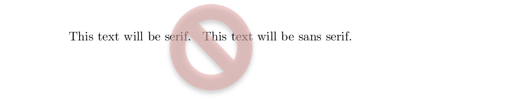
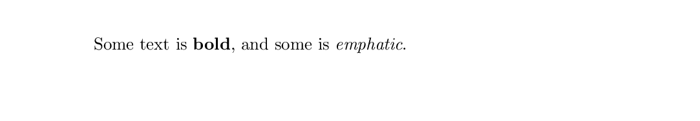
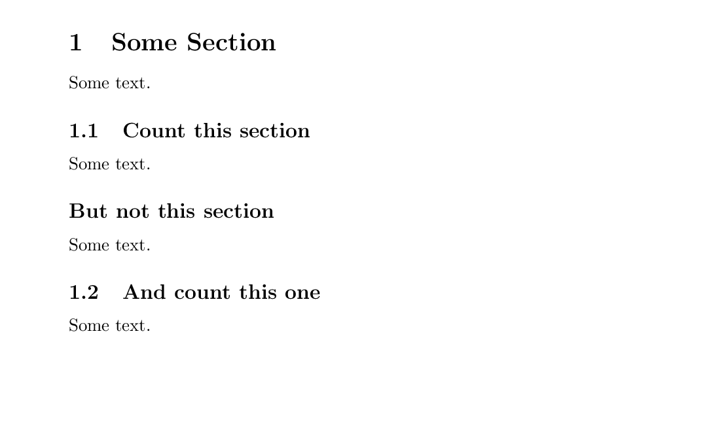
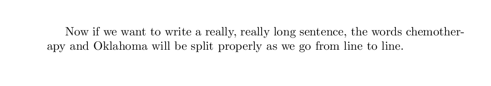

> In this episode we will learn the basic elements of LaTeX formatting options.
{: .callout}

## When and How Lines Break

Remember that LaTeX files are like code, this means that they are compiled like code.  In many
programming languages, line endings do not mean the code stops compiling.  Similarly, in LaTeX, a
single line ending will continue the same block of text as the first line.  This is convenient for
text editors that do not have automatic line breaking enabled (e.g. Windows Notepad).  So how do we
start a new paragraph in LaTeX?  Easy, use **two** newline or carriage returns (i.e. press Enter
twice).

~~~
\documentclass{article}
\begin{document}
  This line and
  this line are the same paragraph

  We use two newlines to start a new paragraph
\end{document}
~~~
{: .language-tex}

We can also manually break lines with the `\\` command.  This special character allows us to
include a line break within a line of our LaTeX code.

~~~
\documentclass{article}
\begin{document}
  This line of code\\is broken into two paragraphs
\end{document}
~~~
{: .language-tex}

## Typeface Controls

In modern [WYSIWYG]({{ page.root }}/reference/#WYSIWYG) editors, we are used to having many choices
for typefaces and font size, many of which don't have much practical use.  LaTeX keeps things clean and simple, by limiting our options.  When the original TeX was invented, there was no format for fonts like exist today.  Indeed, the
`pdflatex` command we are using to compile our documents does not support custom fonts without a
bit of work.  But that is ok!  For academic work, using complicated typefaces can actually distract
from the content.

For our work, we will limit our choices to the following:

#### Font Families

|   Family   |           Definition             |
|:-----------|:---------------------------------|
| \rmdefault | "Roman" or "Serif" font, default |
| \sfdefault | "Sans Serif" font                |
| \ttdefault | "Monospace" font                 |

We can switch between these font families in the preamble of the document by telling LaTeX to renew
which font it will be using.

~~~
\documentclass{article}
\renewcommand{\familydefault}{\sfdefault}
\begin{document}
  This text will be sans serif.
\end{document}
~~~
{: .language-tex}

A `renewcommand` line, can only be used in the preamble.  It's function is to modify what the
default settings for the class are before text parsing begins.

> If you want to use a different typeface than the default LaTeX one called `Computer Modern`, you
> must call a package which interprets font file types such as `.ttf` correctly.  This package is
> called `fontspec`.  Using `fontspec`, we can tell LaTeX to assign different `.ttf` files to the
> various font families.  However, if you want to do this you **must use `xelatex` or `lualatex`**.
> These are alternatives to the `pdflatex` we will be using for the duration of this material.
> Therefore, we will not be covering it in detail here.  Consult the documentation of your LaTeX
> editor for how to change it into `xelatex` or `lualatex` mode.
> ~~~
> \documentclass{article}
> \usepackage{fontspec}
> \setmainfont[
>   Ligatures=TeX,
>   UprightFont = Courier-Boo,
>   ItalicFont = Courier-BooObl,
>   SmallCapsFont = CourierSC-Boo,
>   BoldFont = Courier-Dem,
>   BoldItalicFont = Courier-DemObl
> ]
> \begin{document}
>   We will now use the Courier font familes
> \end{document}
> ~~~
> {: .language-tex}
{: .callout}

#### Relative Typeface Sizes

To change the size of the text when it is compiled, we need to change the font size.  In our
[WYSIWYG]({{ page.root }}/reference/#WYSIWYG) editors, we are used to selecting the specific
size of a font in point(pt) units.  However, in LaTeX, sizes are relative.  The smallest text
in one kind of document class may be the largest in another.  Therefore, we use relative size
names.  When we call a new font size from `tiny` to `Huge`

| Commands (Smallest to Largest)  |
|:-------------------------------:|
|               \tiny             |
|            \scriptsize          |
|           \footnotesize         |
|              \small             |
|            \normalsize          |
|              \large             |
|              \Large             |
|              \LARGE             |
|               \huge             |
|               \Huge             |

Remember, that changing font size is like `renewcommand`.  When we change the font size for our
document, the size change continues until we tell it otherwise.  If you wish to have a small
portion of text a different size, you will need to switch back to `normalsize` when you are done.

Alternatively, we can use curly braces to enclose our changes.  This will keep any size changes
confined to a certain portion of text.

~~~
\documentclass{article}
\begin{document}
  We only want {\Huge these words} to be big.
\end{document}
~~~
{: .language-tex}

> If you simply must use specific font sizes, you need to use a different compiler.  Like before,
> `pdflatex` does not support font sizes beyond certain bounds.  If you want this kind of control,
> you must use either `xelatex` or `lualatex`.
{: .callout}

## Text Formatting (weight, shape, etc.)

LaTeX can modify the format of the text in many of the usual ways including making text bold nad
underlined.  To do this, we must call a command.  The text which is included between the curly
braces at the end of the command will be in the format specified.  This is also a way to
temporarily change the typeface family being used.

#### A Table of Common Text Formatting Options

| Command            | Result                   |
|:-------------------|:-------------------------|
| \textnormal{}      | document font (default)  |
| \emph{}            | emphasis                 |
| \textrm{}          | roman font               |
| \textsf{}          | sans serif font          |
| \texttt{}          | teletypefont (monospace) |
| \textup{}          | upright shape (default)  |
| \textit{}          | italic shape             |
| \textsl{}          | slanted shape            |
| \textsc{}          | Small Caps               |
| \uppercase{}       | ALL CAPS                 |
| \lowercase{}       | all lower case           |
| \textbf{}          | bold weight              |
| \textmd{}          | medium weight (default)  |
| \textlf{}          | light weight             |
| \textsubscript{}   | subscripted characters   |
| \textsuperscript{} | superscripted characters |

~~~
\documentclass{article}
\begin{document}
  Some text is \textbf{bold}, and some is \emph{emphatic}.
\end{document}
~~~
{: .language-tex}

## Sections

Information is best displayed when well organized and in bite-sized parts.  For this reason, nearly
all documents are split into various sections.  A book has chapter, an article has sections, etc.
In LaTeX documents can be divided into multiple types of sections with different hierarchy levels.
The default configuration of LaTeX has several of these built in, and certain styles have even
more:

#### Section Levels

| Command          | Level |
|:-----------------|:-----:|
| \part{}          | -1    |
| \chapter{}       | 0     |
| \section{}       | 1     |
| \subsection{}    | 2     |
| \subsubsection{} | 3     |
| \paragraph{}     | 4     |
| \subparagraph{}  | 5     |

Each of these sections can have different formatting depending on the style sheet which has been
declared.  The sections are numbered, and automatically update the numbering information based on
the position when compiling.  The title of the section is entered into the curly braces of the
command, and all of the text below the command, until the section is changed, is formatted for
that particular section level.

> It is a [best practice]({{ page.root }}/reference/#best practice) to use tabs (four spaces) to
> denote text within sections.  That makes it easier for anyone reading the code to understand it.
> For example, the text starts out with no indents, then all text within the `document` environment
> is indented once.  All text within the first `section` is indented once more.  Text in a
> `subsection` is indented yet again.  And so on.
> ~~~
> \documentclass{article}
> \begin{document}
>   \section{Introduction}
>     Some introductory text.
>     \subsection{Specific Intro Information}
>       The specifics.
>   \section{Conclusion}
>     Concluding remarks.
> \end{document}
> ~~~
> {: .language-tex}
{: .callout}

Each time the document encounters a section, it will print the title of the section and the number.
However, in certain cases, sections should not be given numbers.  To prevent a section from
increasing the counter and printing the section number, an asterisk (`*`) is added to the command.

~~~
\documentclass{article}
\begin{document}
  \section{Some Section}
    Some text.
    \subsection{Count this section}
      Some text.
    \subsection*{But not this section}
      Some text.
    \subsection{And count this one}
      Some text.
\end{document}
~~~
{: .language-tex}

## Alignment

#### Alignment Options

| Command      | Result      |
|:-------------|:------------|
| \raggedleft  | align left  |
| \raggedright | align right |
| \centering   | centered    |

## Color

Color is not native to LaTeX, and must be handled by an external package.  There are several
options for packages which handle color, but we will be using `xcolor`.  This is a modernized
variant of the original `color` package.  To make some text have color, we use the command
`textcolor`:

~~~
\documentclass{article}
\usepackage{xcolor}
\begin{document}
  \textcolor{red}{This text will be red}
\end{document}
~~~
{: .language-tex}

LaTeX knows only a few colors by default:

#### Default Colors

|    Color   |    Color   |    Color   |    Color   |
|:----------:|:----------:|:----------:|:----------:|
|    black   |    blue    |    brown   |    cyan    |
|  darkgray  |    gray    |    green   |  lightgray |
|    lime    |   magenta  |    olive   |   orange   |
|    pink    |   purple   |     red    |    teal    |
|   violet   |    white   |   yellow   |            |

If we want to use another color, we need to make it.  Colors are made in different colorspaces
such as `RGB` or `cmyk`.  We can mix colors in these colorspaces and assign them a name using
`definecolor` in the preamble of our document.  The new color is named, we declare a colorspace,
then we provide the values for that colorspace which represents our color. Each time we want to
use the color, we can call it in the normal way.

~~~
\documentclass{article}
\usepackage{xcolor}
\definecolor{crimson}{RGB}{52, 9, 9}
\begin{document}
  \textcolor{crimson}{This text will be crimson}
\end{document}
~~~
{: .language-tex}

## Custom Dictionaries

LaTeX is a powerful typesetting tool that automatically hyphenates words across new lines.  While
some text editors simply break the line before a long word is used, LaTeX will try to hyphenate
between syllables of the word.  This makes the output text look much cleaner and professional.
However, LaTeX is not magic.  Not all words are defined syllabically in the dictionary.  When we
use a word that is more complicated, and is in danger of making ugly line breaks, we need to tell
LaTeX how to break the word apart.  We do this with the `hyphenation` command in the preamble.
Each word is separated by a space.

Certain words are more likely to need hyphenation.  These include proper nouns and words that
are relatively "new".

~~~
\documentclass{article}
\hyphenation{Ok-la-ho-ma che-mo-ther-apy}
\begin{document}
  Now if we want to write a really, really long sentance, the words chemotherapy and Oklahoma
  will be split properly as we go from line to line.
\end{document}
~~~
{: .language-tex}

## Quotation Marks

<!-- TODO consider languages and how to present this -->

## Fancy Characters with Escaped Sequences

As we have seen, certain characters are used by the LaTeX code to do certain commands.  The percent
sign (`%`) is used for comments and the curly braces (`{`, `}`) contain code.  What do we do if we
want these characters in our text?  We need to use a special
[escape sequences]({{ page.root }}/reference/#escape sequence) to introduce these characters.
There are many of these types of characters, and they can be called in the text at any time.

#### Table of Special Characters

|       Command       | Character |
|:--------------------|:---------:|
| \%                  |   `%`     |
| \\$                 |   `$`     |
| \\{                 |   `{`     |
| \\_                 |   `_`     |
| \P                  |   `¶`     |
| \ddag               |   `‡`     |
| \textbar            |   `|`     |
| \textgreater        |   `>`     |
| \textendash         |   `–`     |
| \texttrademark      |   `™`     |
| \textexclamdown     |   `¡`     |
| \textsuperscript{2} |   `²`     |
| \pounds             |   `£`     |
| \\#                 |   `#`     |
| \&                  |   `&`     |
| \\}                 |   `}`     |
| \S                  |   `§`     |
| \dag                |   `†`     |
| \textbackslash      |   `\`     |
| \textless           |   `<`     |
| \textemdash         |   `—`     |
| \textregistered     |   `®`     |
| \textquestiondown   |   `¿`     |
| \textcircled{a}     |   `ⓐ`     |
| \copyright          |   `©`     |
| \ldots              |  `. . .`  |

<!--NOTE Several of these sequences use Markdown escape characters, and must be double escaped.
The correct way to use this table is to view the HTML output.-->

Since LaTeX is an old language, certain characters are not present within the default
configuration.  These characters must be called using a package.  One notable example is the
Euro currency sign.  This currency did not exist in the 1970's so we can't use it without
defining it in a package.

~~~
\usepackage[gen]{eurosym}
~~~
{: .language-tex}

## Accented Letters

Sometimes words used in the academic context use symbols that are outside of what is considered
"normal" English orthography.  Many language use character accents to distinguish sounds that
use similar vowels.  LaTeX is capable of generating these characters based on special sequences
which modify existing letters.

#### Table of Accented Characters

| Command |Sample| Description                              |
|:-------:|:----:|:-----------------------------------------|
| \\`{o}  |   ò  | grave accent                             |
| \\'{o}  |   ó  | acute accent                             |
| \^{o}   |   ô  | circumflex                               |
| \\"{o}  |   ö  | umlaut, trema or dieresis                |
| \H{o}   |   ő  | long Hungarian umlaut (double acute)     |
| \\~{o}  |   õ  | tilde                                    |
| \c{c}   |   ç  | cedilla                                  |
| \k{a}   |   ą  | ogonek                                   |
| \l{}    |   ł  | barred l (l with stroke)                 |
| \\={o}  |   ō  | macron accent (a bar over the letter)    |
| \b{o}   |   o  | bar under the letter                     |
| \\.{o}  |   ȯ  | dot over the letter                      |
| \d{u}   |   ụ  | dot under the letter                     |
| \r{a}   |   å  | ring over the letter                     |
| \u{o}   |   ŏ  | breve over the letter                    |
| \v{s}   |   š  | caron/háček ("v") over the letter        |
| \t{oo}  |  o͡o | "tie" (inverted u) over the two letters  |
| \o      |   ø  | slashed o (o with stroke)                |

<!--NOTE Several of these sequences use Markdown escape characters, and must be double escaped.
The correct way to use this table is to view the HTML output.-->

## Hyphenation Differentiation

In English, different hyphens are used for different meanings.  These can be printed in the text
by including different numbers of short hyphens in the code.  The obvious outlier here is the minus
sign.  Using math requires entering [math mode]({{ page.root }}/reference/#escape sequence),
something which will be covered in more detail later.  For now, it is worthwhile to note that math
symbols can be used within the text by surrounding the symbol with the dollar sign (`$`).

#### Table of Dashes

| Input   | Output | Purpose     |
|:--------|:------:|:------------|
| `-`     |    -   | inter-word  |
| `--`    |    –   | page range  |
| `---`   |    —   | punctuation |
| `$-$`   |    −   | minus sign  |

## Controlling Space

Often it is important to control the space around words and blocks of text in a document.  We can
group instances in which this is important into horizontal space (left and right) and vertical
space (above and below).

### Horizontal Space

As should be apparent, LaTeX respects spaces between words written in the code.  However, there are
limits.  Consecutve spaces grouped together are treated as a single space.  This allows LaTeX to
always print a correct looking document, no matter how a user chooses to space out their words.  If
an extra space is required, LaTeX needs to be told this.  Entering the tilde (`~`) into the code
tells LaTeX to add another space, no matter the circumstances.

This has a secondary use.  Some words should appear together on a line to make sense, such as
acronyms and names.  By replacing the normal space with the tilde, we treat those words as a
single string when it comes to wrapping the text on the page, yet still print a space between each
word.

### Vertical Space

Controlling vertical space is similar to horizontal space.  As we discussed early in this section,
LaTeX requires double returns to break a paragraph, and a line break can be forced with `\\`.
One caveat is that each forced line break must include something on the next line.  Therefore the
sequence `\\\\` is meaningless and will cause errors.  If you want to skip more than one line
without including any text on the next line, the simplest way to do this is with a tilde.  The
sequence `\\~\\` will skip two lines.

Another convenient vertical spacer is the skip.  Using the command `\smallskip`, `\medskip`, or
`\bigskip` will produce a small, medium, or large blank space between lines of text.  This is
useful for distinguishing portions of a document.  The lengths of these skips are dependent on
the `documentclass` you are writing in.

The largest vertical spacer available is the `\newpage` command.  As you might expect, this forces
LaTeX to end the current page and start a new one at that point.

There are many other options for controlling space, with much more refinement.  However, that
begins to get more complicated than we will cover in this course.  For now, stick with these.


